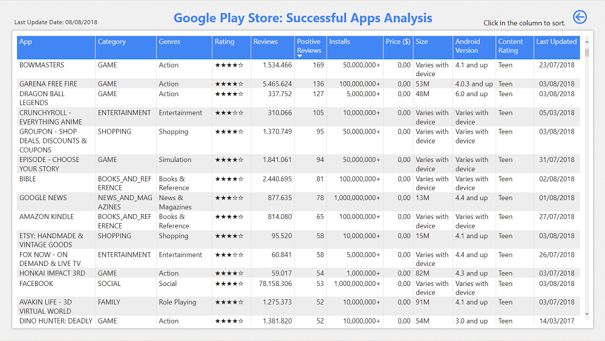

# Google Play Store 

---

## **Introdução do Problema**

Você quer lançar um aplicativo na loja do Google, mas não sabe qual tipo de app? Ou apenas estaria curioso para saber quais características teria um app com maior chance de fazer sucesso no Google Play Store? 

Para responder e explorar tais perguntas, utilizei o dataset disponível no Kaggle e desenvolvi um dashboard no Power BI.  

**Problema**: Uma empresa deseja lançar um aplicativo na loja do Google (Google Play Store) e, para isso, precisa identificar quais aplicativos possuem uma maior chance de fazer sucesso.

**Dataset**: Dados foram extraídos do Kaggle: https://www.kaggle.com/datasets/lava18/google-play-store-apps  
Este dataset é formado por dois arquivos CSV:  
* **googleplaystore.csv**: Apresenta detalhes dos aplicativos no Google Play. Existem 13 variáveis que descrevem um determinado aplicativo. 
* **googleplaystore_user_reviews.csv**: Este arquivo contém as primeiras 100 avaliações "mais relevantes" para cada aplicativo. 

**Dicionário de Dados**: Abaixo segue uma descrição das variáveis utilizadas para a construção do dashboard.

**Dataset: googleplaystore.csv**  
* App: nome do aplicativo.  
* Category: categoria à qual pertence o aplicativo.   
* Rating: avaliação do aplicativo.  
* Reviews: número de comentários do usuário.  
* Size: tamanho do aplicativo.  
* Installs: número de downloads / instalações.  
* Type: se o aplicativo é gratuito ou pago.  
* Price: preço do aplicativo em dólar.  
* Content Rating: faixa etária para qual o aplicativo é direcionado.  
* Genres: usabilidade do aplicativo (designer, ferramenta, entretenimento).  
* Last Updated: data da última atualização do aplicativo.  
* Current Ver: versão atual do aplicativo.  
* Android Ver: versão mínima exigida do Android.  

**Dataset: googleplaystore_user_reviews.csv**  
* App: nome do aplicativo.  
* Translated_Review: comentário traduzido para o inglês.  
* Sentiment: se o comentário foi classificado como positivo, negativo ou neutro.  

**Para acessar e navegar pelo dashboard no Power BI**, clique [aqui](https://app.powerbi.com/view?r=eyJrIjoiYTI4ZjRkMmUtYTk2ZS00N2VkLTllNjgtY2ZkNWVmNGI1MzBkIiwidCI6IjgxMTFjMzgxLThjM2EtNDNkMS05ODc4LTA5ZjAzZGQ0N2Y1NiJ9).

## **Desenvolvimento** 

No início do desenvolvimento, analisei os dados no dataset e verifiquei a qualidade dos dados já pensando em quais variáveis iriam me ajudar a responder o problema. Após essa primeira análise, realizei o tratamento e a limpeza dos dados no próprio Power Query Editor do Power BI. E posteriormente, realizei o relacionamento entre as tabelas e criei outras tabelas de apoio. 

Para começar a construir o dashboard, selecionei como métricas de sucesso: 
- **Rating (Avaliação do aplicativo)**: entendo que aplicativos com avaliações altas tendem a ser mais bem sucedidos. 
- **Review's Sentiment (Sentimento das avaliações)**: positivo, negativo ou neutro): entender o sentimento das avaliações dos usuários pode dar um indicativo se os usuários estão ou não gostando do aplicativo, e quais os pontos fortes e fracos do aplicativo avaliado. 
- **Installs / Downloads (Quantidade de downloads ou instalações)**: um aplicativo com grande quantidade de downloads também indica que o app está sendo bastante utilizado.  
- **Reviews (Quantidade de comentários)**: normalmente tendemos a escrever um comentário quando gostamos bastante do app e verificamos que vale a pena comentar, ou quando não estamos muito satisfeito com ele. Desta forma, esta métrica poderia ser avaliado em conjunto com o sentimento. 

O dashboard foi desenvolvido pensando em duas dinâmicas: analisar e filtrar as métricas de sucesso individualmente (que eu chamei de "By Metric") ou combiná-las de diversas formas (que eu denominei como "All Metrics").

Na primeira tela do dashboard ("All Metrics) (vide imagem abaixo), podemos filtrar os dados pelas métricas de sucesso mencionadas acima, combinando-as da forma que desejar. Temos também um quadro de Sumário (Summary) com um breve resumo das informações.

E colocando o mouse sobre uma barra do gráfico, extraímos mais informações a respeito da variável. 

Podemos analisar o detalhe das informações clicando em uma barra de um dos gráficos. Com isso, o botão para visualizar os detalhes é habilitado. 

E então podemos analisar as características de cada app dentro da variável selecionada. Ou ainda, ordenando a tabela podemos extrair o app com mais instalações, ou mais avaliações, ou com uma avaliação maior. Basta clicar no nome da coluna da tabela para ordená-la. 

Na segunda tela do dashboard ("By Metrics") (vide imagem abaixo), podemos analisar os dados de acordo com a métrica filtrada:
- **Rating**: média da nota de avaliação do aplicativo
- **Reviews**: quantidade de comentários em milhões
- **Positive**: Reviews: quantidade de avaliações positivas 
- **Installs**: quantidade de instalações ou download em bilhões

Aqui também podemos colocar o mouse sobre uma barra do gráfico para extrair mais informações. Ou buscar informações detalhadas clicando em uma barra de qualquer gráfico que se queira analisar. 

## **Conclusão**

Principais conclusões e insights que podemos extrair dessas informações:
- Se definirmos que o app de sucesso é aquele com avaliação acima de 4, sentimento positivo, mais de 1.000 downloads e mais de 1.000 comentários, teremos que o aplicativo deve estar na categoria de jogos (e do tipo ação) ou um aplicativo que se classifique como ferramenta, de preferência gratuito, e que seja para todas as faixas etárias. 
- Examinando a nota de avaliação, aplicativos de eventos são bem apreciados. 
- Avaliando a quantidade de comentários em geral, os aplicativos de comunicação são mais comentados. 
- Levando em conta as avaliações com sentimento positivo, aplicativos de saúde e bem estar possuem mais comentários. 
- Considerando a quantidade de downloads, a categoria de jogos possuem mais instalações com preferência para o gênero Arcade, seguido por Ação.

**Para acessar e navegar pelo dashboard no Power BI**, clique [aqui](https://app.powerbi.com/view?r=eyJrIjoiYTI4ZjRkMmUtYTk2ZS00N2VkLTllNjgtY2ZkNWVmNGI1MzBkIiwidCI6IjgxMTFjMzgxLThjM2EtNDNkMS05ODc4LTA5ZjAzZGQ0N2Y1NiJ9).
